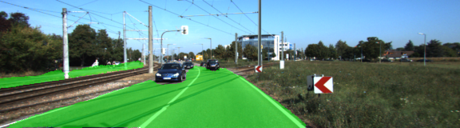
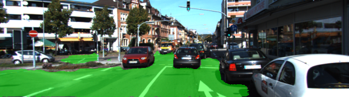
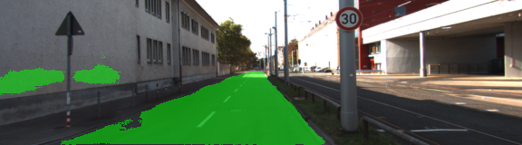
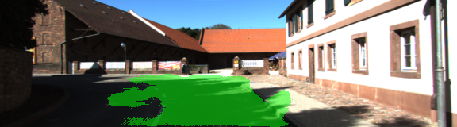

# UDACITY Self-Driving Car Nanodegree Program
## Segmentation of pixels of a road in images using a Fully Convolutional Network (FCN)

With this repo, I am submitting my solution to the semantic segmentation project of the Self-Driving Car Nanodegree Program. The objective of the pipeline is to implement a Fully Convolutional Network for the detection of those pixels that belong to the road in images of the Kitti Road dataset. 

The FCN is built upon the [VGG16 model](https://s3-us-west-1.amazonaws.com/udacity-selfdrivingcar/vgg.zip) in the encoder stage of the network. Then, a 1x1 convolution is applied to the layers 3, 4, and 7, to preserve the spatial information enabling the upsampling operation (or transpose convolution) of the VGG16 layers' output, later in the decoder stage. The FCN also implements a skip architecture to fuse coarser but higher resolution features from the lower layers 3 and 4, with layer 7.The complete FCN model can be found in main.py code lines 47-86.

In general, the FCN model performs well in dectecting the road pixels, as can be observed in the figures below.

However, under demanding light conditions, some portions of the road are missed or other regions of the image are interpreted as road sections (See figures below). Such a flaw can be overcome by augmenting the training dataset with images with rotation and brightness distortion.

